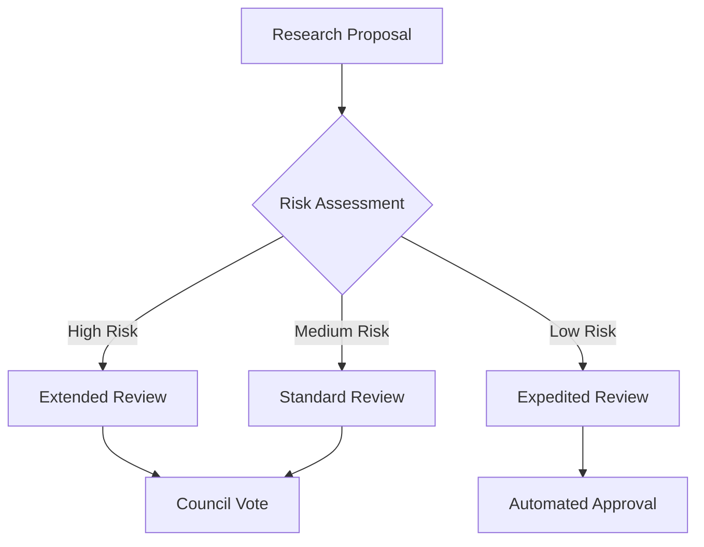

# Quantum Vacuum Fluctuation Harvesting Network (QVFHN)

## System Architecture

A decentralized network for detecting, measuring, and responsibly extracting energy from quantum vacuum fluctuations while maintaining spacetime stability.

### Core Components

#### 1. Detection Infrastructure
```
├── Quantum Field Sensors
│   ├── Vacuum Fluctuation Detectors
│   │   ├── Casimir Effect Monitors
│   │   └── Zero-Point Energy Sensors
│   └── Field Strength Analyzers
└── Measurement Systems
    ├── Energy Density Mapping
    └── Temporal Stability Monitoring
```

#### 2. Energy Extraction Framework
```solidity
contract VacuumEnergyHarvester {
    struct Harvester {
        uint256 deviceId;
        bytes32 locationHash;
        uint16 efficiency;
        address operator;
        uint256 energyExtracted;
        bool active;
    }
    
    struct ExtractionZone {
        uint256 zoneId;
        uint256 energyDensity;
        uint32 stabilityIndex;
        bool approved;
    }
    
    mapping(uint256 => Harvester) public harvesters;
    mapping(uint256 => ExtractionZone) public zones;
}
```

### Technical Specifications

#### Quantum Detection Systems
1. Sensor Array Configuration
    - Casimir cavity detectors
    - Zero-point field monitors
    - Vacuum state analyzers

2. Measurement Protocols
    - Energy density calculation
    - Fluctuation frequency analysis
    - Stability assessment

#### Extraction Technology
```
├── Energy Collectors
│   ├── Quantum Field Resonators
│   ├── Vacuum State Modulators
│   └── Energy Conversion Units
└── Safety Systems
    ├── Field Stabilizers
    └── Containment Arrays
```

### Safety Mechanisms

#### 1. Field Stability
- Continuous vacuum state monitoring
- Real-time field strength analysis
- Automatic shutdown protocols

#### 2. Energy Management
```
Maximum Extraction Rate = Base Energy * (Stability Factor / Safety Coefficient)
System Efficiency = (Energy Extracted / Field Perturbation) * Conversion Rate
```

### Network Infrastructure

#### Smart Contract Architecture
```
├── Core Contracts
│   ├── HarvesterRegistry.sol
│   ├── EnergyMarket.sol
│   ├── SecurityProtocol.sol
│   └── GovernanceSystem.sol
├── Oracle Network
│   ├── EnergyMeasurement.sol
│   └── StabilityVerification.sol
└── Token Systems
    ├── GovernanceToken
    └── EnergyCredits
```

### Governance Framework

#### Research Priorities
1. Initial Assessment
    - Location evaluation
    - Energy density mapping
    - Stability analysis

2. Implementation Protocol
    - Equipment deployment
    - Safety system activation
    - Monitoring setup

#### Decision Making


### Economic Model

#### Token Utility
- QVAC (Quantum Vacuum) governance token
- Energy credit system
- Research funding allocation

#### Market Dynamics
```
Energy Value = Base Rate * (Purity Level + Stability Metric)
Operator Reward = Energy Harvested * Efficiency Factor * Stake Amount
```

### Research Collaboration

#### Platform Features
1. Data Sharing
    - Real-time measurements
    - Extraction efficiency data
    - Stability metrics

2. Analysis Tools
    - Field mapping software
    - Energy flow modeling
    - Stability prediction

### Future Development

#### Phase 1: Detection Network
- Sensor array deployment
- Basic measurement systems
- Initial safety protocols

#### Phase 2: Extraction Systems
- Energy harvesting technology
- Conversion infrastructure
- Enhanced safety measures

#### Phase 3: Scale-Up
- Network expansion
- Efficiency optimization
- Advanced applications

## Technical Considerations

### Performance Metrics
1. Detection Accuracy
    - Energy density precision
    - Fluctuation frequency resolution
    - Temporal stability measurement

2. Extraction Efficiency
    - Energy conversion rate
    - System losses
    - Stability maintenance

### Safety Parameters

#### 1. Field Stability
- Vacuum state integrity
- Local field strength
- Perturbation limits

#### 2. Emergency Protocols
- Automatic shutdown triggers
- Field stabilization measures
- Energy dissipation procedures

### Environmental Impact

#### 1. Local Effects
- Spacetime stability
- Field strength variations
- Energy gradient management

#### 2. Monitoring Systems
- Continuous field mapping
- Stability trend analysis
- Impact assessment

## Implementation Guidelines

### Deployment Process
1. Site Selection
    - Energy density mapping
    - Stability assessment
    - Infrastructure requirements

2. System Installation
    - Sensor array setup
    - Harvester deployment
    - Safety system activation

### Operational Procedures
1. Monitoring Protocol
    - Real-time data collection
    - Stability verification
    - Performance tracking

2. Maintenance Requirements
    - Regular calibration
    - Safety system checks
    - Efficiency optimization

## Conclusion

The Quantum Vacuum Fluctuation Harvesting Network represents a careful approach to exploring and potentially utilizing quantum vacuum energy while maintaining strict safety protocols and scientific rigor.
